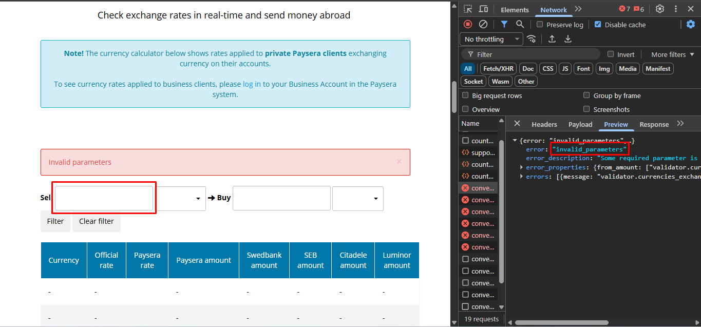

## Bug #1 – Missing Validation for Non-Numeric Input

**Severity:** High

**Steps to Reproduce:**
1. Enter alphabetic characters into the amount input field
2. Tap on the Filter button

**Actual Result:**
- 400 Request displays
- Validation message still displays after page reload
- UI/UX is not user-friendly

**Expected Result:**
- Prevent send request to backend
- UI validation is displayed (Filter button is disabled)

**Evidence:**
- See screenshot: 

### Improvement #2 — Default value in "Sell" amount field affects usability

**Description:**  
When opening the currency conversion calculator, the "Sell" amount field is prefilled with a value of `100`.

**Steps to observe:**
1. Open Currency Conversion Calculator
2. Focus the "Sell" amount input field
3. Try to enter a custom value

**Actual behavior:**  
User must manually delete the default value `100` before entering a new amount.

**Expected behavior:**  
One of the following UX improvements:
- Use a placeholder instead of a prefilled value  
  **or**
- Automatically clear the default value on first user input (focus or typing)

**Impact:**  
Slows down the primary user flow and introduces unnecessary friction during repeated use.

**Priority:** Low / Medium (UX improvement)

**Evidence:**
- See screenshot: 

### Bug #3 — Same currency selection causes empty result state

**Steps to reproduce:**
1. Open Currency Conversion Calculator
2. Select the same currency for both "Sell" and "Buy" (e.g. EUR → EUR)
3. Observe the result area

**Actual result:**  
Calculator displays an empty state without any validation message or guidance.

**Expected result:**  
System should prevent selecting the same currency  
**or**  
Display a clear informational message (e.g. "Please select different currencies").

**Impact:**  
User is left without feedback and may assume the calculator is broken.

**Severity:** Medium

**Evidence:**
- See screenshot: 

### Improvement #4 — Default value in "Sell" amount field affects usability

**Description:**  
When entering a value in the "Sell" input field, the "Buy" field remains empty. The conversion results are shown only in the table below, but the "Buy" input is never populated automatically.

**Steps to reproduce:**
1. Open the Currency Conversion Calculator
2. Enter any numeric value in the "Sell" field (e.g., 1.11)
3. Observe the "Buy" input field

**Actual behavior:**  
"Buy" input remains empty; user must refer to the table to see converted amounts.

**Expected behavior:**  
- The "Buy" input could be auto-populated with the main conversion result  
- Or, a clear indication that values are shown in the table, not in the input field

**Impact:**  
May confuse users who expect the "Buy" field to display the converted amount directly.

**Priority:** Low / Medium

**Evidence:**
- See screenshot: 

### Bug #5 — Negative value input is accepted without validation

**Description:**  
When entering negative numbers in the "Sell" input field, the calculator processes them and displays negative conversion results without any validation or warning.

**Steps to Reproduce:**
1. Open the Currency Conversion Calculator
2. Enter a negative number in the "Sell" field (e.g., -111)
3. Observe the conversion result table

**Actual Result:**  
- Calculator displays negative amounts in all columns  
- No validation message or restriction prevents negative input

**Expected Result:**  
- System should prevent negative values from being entered  
**or**  
- Display a clear error message indicating that negative amounts are invalid

**Impact:**  
- User may be misled into thinking negative conversions are valid  
- Could cause incorrect financial decisions if applied in real transactions

**Severity:** Medium

**Evidence:**
- See screenshot: 
