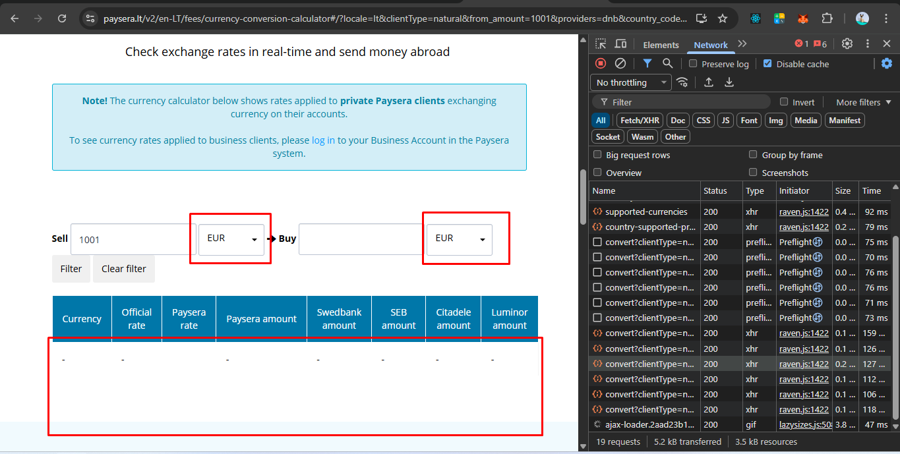
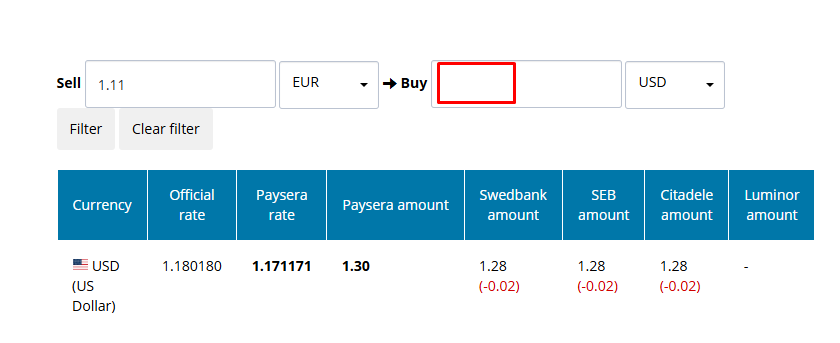

# Test Execution Results  
Currency Conversion Calculator

---

## Test Scope
Manual testing of the Currency Conversion Calculator available at:  

Testing focused on:
- Core conversion functionality
- Input validation
- Currency selection behavior
- Boundary cases
- UX and responsiveness

---

## Legend
- [x] — Passed  
- [ ] — Failed / Improvement required

---

## Smoke Testing
- [x] Page loads successfully
- [x] Calculator component is visible
- [x] Amount input fields are interactive
- [x] Currency selectors are available
- [x] Conversion result table is displayed

---

## Functional Testing

### Input Handling
- [x] Valid numeric input conversion  
  _Result:_ Conversion result updates immediately after input change

- [x] Decimal value handling  
  _Result:_ Decimal values are accepted and processed with correct precision

- [ ] Non-numeric input validation  
  _Result:_ Alphabetic characters are accepted without a validation message  
  _Reference:_ Bug #1  
  _Attachment:_ 

- [ ] Negative value handling  
  _Result:_ Negative values are accepted and conversion is performed  
  _Reference:_ Bug #5  
  _Attachment:_ 

### Currency Selection
- [ ] Same currency conversion (e.g. EUR → EUR)  
  _Result:_ Empty table displayed without validation  
  _Reference:_ Bug #3  
  _Attachment:_ 

- [x] Rapid currency switching  
  _Result:_ No UI freeze or calculation delay observed

---

### Buy Field Behavior
- [ ] "Buy" input remains empty after entering Sell amount  
  _Result:_ User must refer to table to see converted amount  
  _Reference:_ Improvement #4  
  _Attachment:_ 

---

## Boundary & Edge Case Testing
- [x] Large amount conversion (e.g. 1,000,000+)  
  _Result:_ Result is calculated and displayed correctly

- [x] Minimum value input (e.g. 0 or near-zero)  
  _Result:_ Calculator behaves consistently without errors

---

## UX & Usability
- [x] Conversion result visibility  
  _Result:_ Result is clearly visible and readable

- [x] Error feedback visibility  
  _Result:_ No blocking UI issues observed

- [x] Mobile responsiveness  
  _Result:_ Layout adapts correctly on smaller screen sizes

- [ ] Sell input prefilled value usability  
  _Result:_ User must manually delete default `100`  
  _Reference:_ Improvement #2  
  _Attachment:_ 

---

## Summary
- Total scenarios executed: 15  
- Passed: 10  
- Failed / Improvements suggested: 5  

Key risks / improvements identified:
- Missing validation for non-numeric input (Bug #1)  
- Negative values accepted without validation (Bug #2)  
- Same currency selection allows empty table (Bug #3)  
- "Buy" input remains empty (Improvement #4)  
- Sell input default value slows down user input (Improvement #2)

Detailed findings are documented in the **Bugs & Improvements Report** with supporting screenshots.
```

